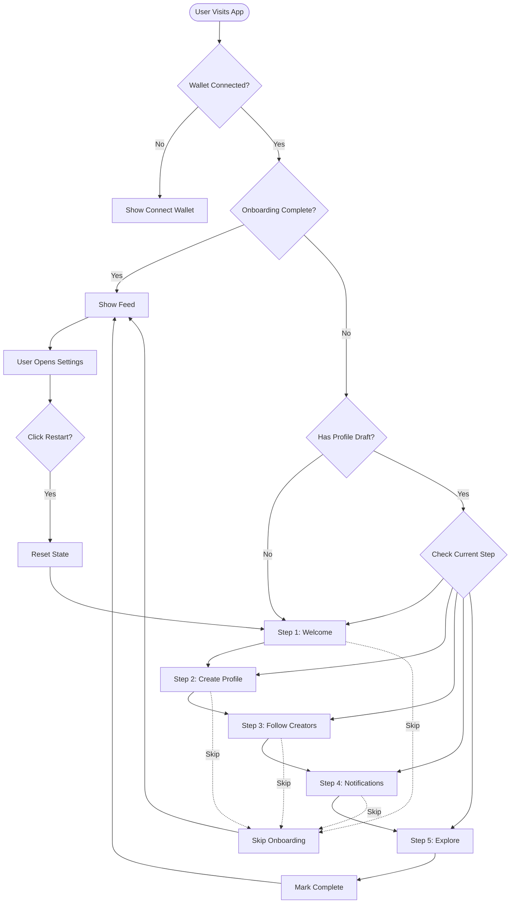
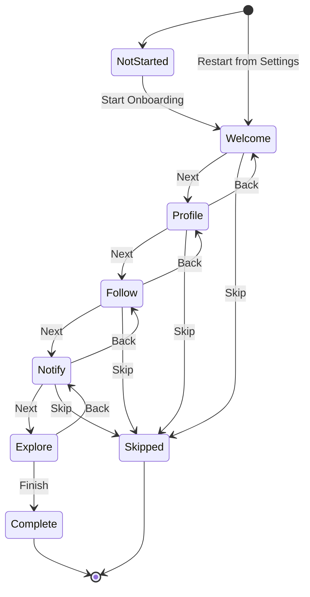
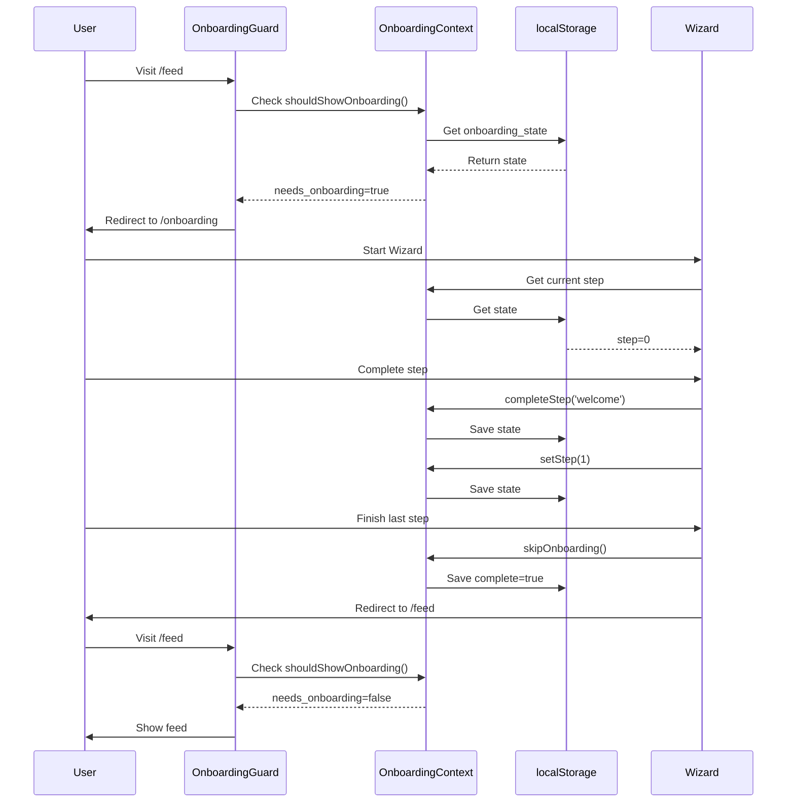
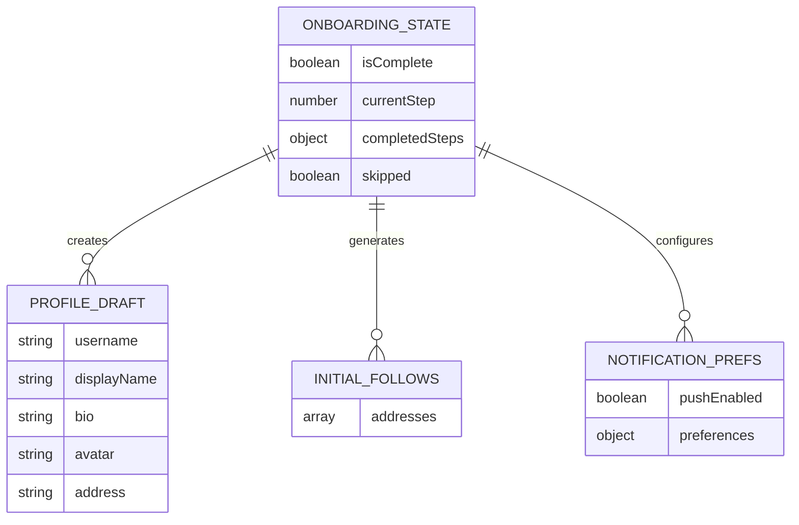
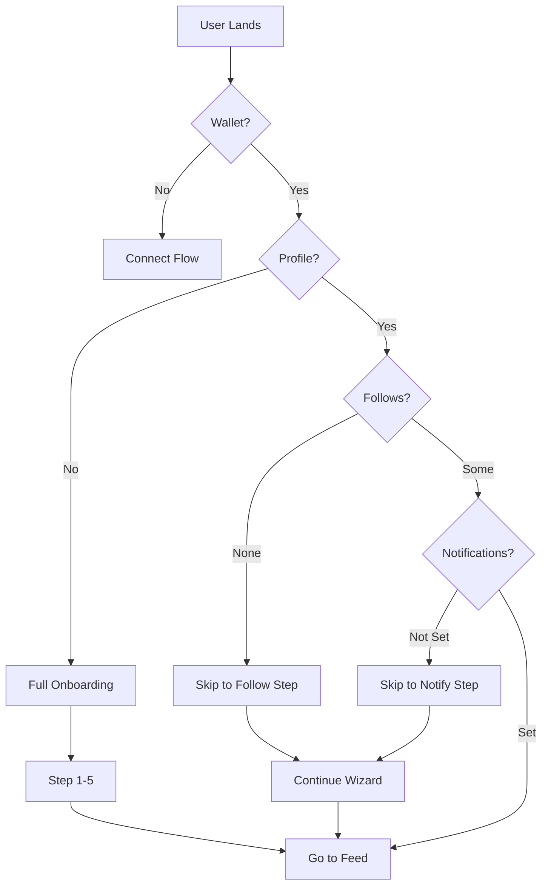
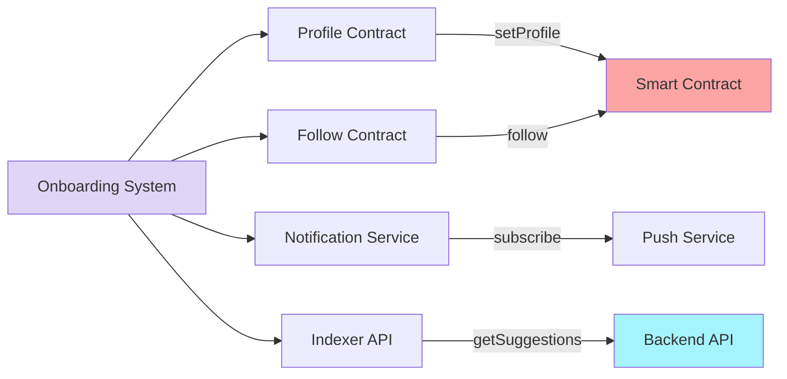
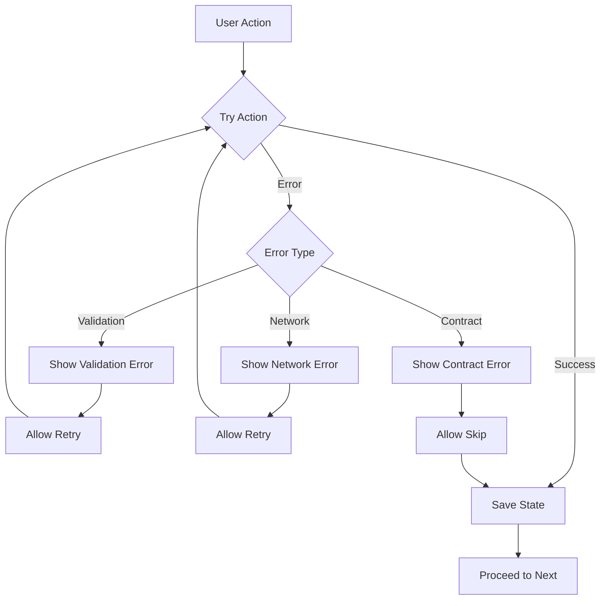

# Onboarding Flow Diagram

## User Journey



## State Machine



## Component Hierarchy

```mermaid
graph TD
    RootLayout[Root Layout]
    RootLayout --> OnboardingProvider
    OnboardingProvider --> App[App Content]
    
    App --> OnboardingPage[/onboarding]
    OnboardingPage --> Wizard[OnboardingWizard]
    
    Wizard --> Step1[WelcomeStep]
    Wizard --> Step2[ProfileStep]
    Wizard --> Step3[FollowStep]
    Wizard --> Step4[NotificationStep]
    Wizard --> Step5[ExploreStep]
    
    App --> FeedPage[/feed]
    FeedPage --> Guard[OnboardingGuard]
    Guard --> FeedContent[Feed Content]
    
    App --> SettingsPage[/settings]
    SettingsPage --> OnboardingSettings
    
    style OnboardingProvider fill:#e1d5f7
    style Wizard fill:#c7b8ea
    style Guard fill:#fde68a
```

## Data Flow



## Storage Schema



## Step Progress

```mermaid
gantt
    title Onboarding Steps Timeline
    dateFormat X
    axisFormat %s
    
    section Welcome
    Welcome Screen: 0, 30s
    
    section Profile
    Fill Form: 30s, 120s
    Validation: 120s, 130s
    
    section Follow
    Browse Creators: 130s, 180s
    Select Follows: 180s, 210s
    
    section Notifications
    Review Options: 210s, 240s
    Enable Push: 240s, 250s
    Configure Prefs: 250s, 270s
    
    section Explore
    View Featured: 270s, 300s
    Complete: 300s, 310s
```

## Decision Tree



## Integration Points



## Error Handling



---

## Legend

- **Solid lines** = Primary flow
- **Dashed lines** = Alternative/skip flow
- **Diamonds** = Decision points
- **Rectangles** = Actions/Steps
- **Ovals** = Start/End points
